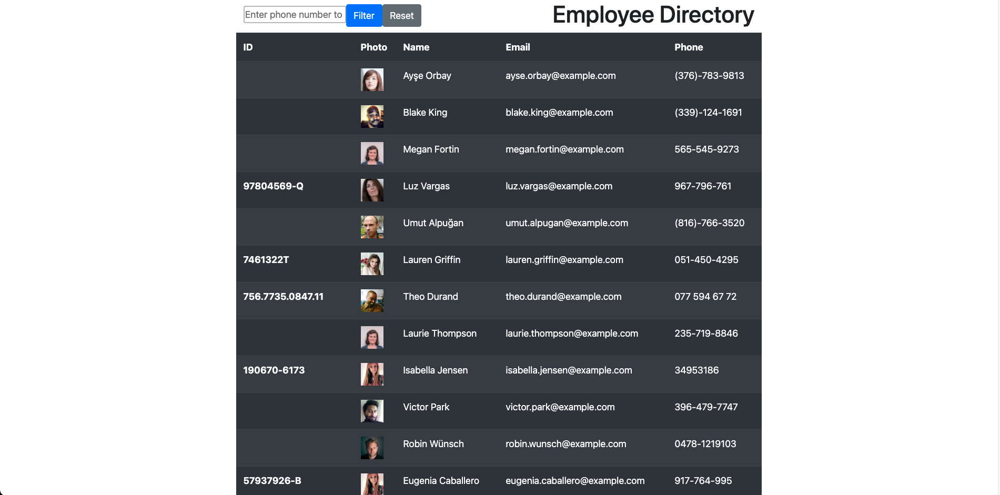
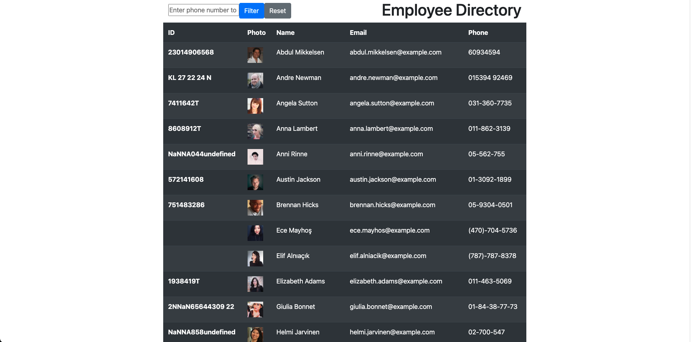
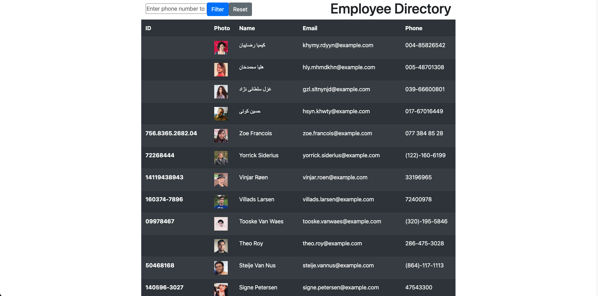
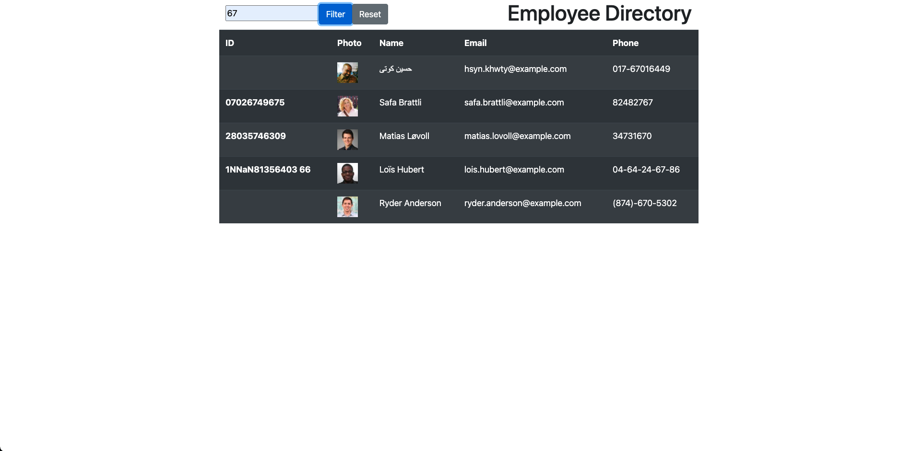
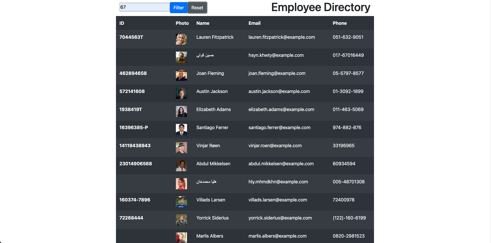

# Employee Directory

**Description**

This app allows you to view your employee directory. You can sort by name ascending or descending. You can also filter by number.

**Installation**

Click on the link. https://dnfrancis22.github.io/employee-directory/

**Usage**

When the page loads you are presented with a list of employees.

You can sort the list ascending and descending. Click name and the list will sort ascending.

Click name again and the list will sort descending.

You can filter the list by a specific number. Enter a number into the field and click search. A list of employees with a phone number that contain the number you entered will appear.

If you click reset the original list will appear.

**License**

MIT License

Copyright (c) [2021] [Dennis Francis]

Permission is hereby granted, free of charge, to any person obtaining a copy
of this software and associated documentation files (the "Software"), to deal
in the Software without restriction, including without limitation the rights
to use, copy, modify, merge, publish, distribute, sublicense, and/or sell
copies of the Software, and to permit persons to whom the Software is
furnished to do so, subject to the following conditions:

The above copyright notice and this permission notice shall be included in all
copies or substantial portions of the Software.

THE SOFTWARE IS PROVIDED "AS IS", WITHOUT WARRANTY OF ANY KIND, EXPRESS OR
IMPLIED, INCLUDING BUT NOT LIMITED TO THE WARRANTIES OF MERCHANTABILITY,
FITNESS FOR A PARTICULAR PURPOSE AND NONINFRINGEMENT. IN NO EVENT SHALL THE
AUTHORS OR COPYRIGHT HOLDERS BE LIABLE FOR ANY CLAIM, DAMAGES OR OTHER
LIABILITY, WHETHER IN AN ACTION OF CONTRACT, TORT OR OTHERWISE, ARISING FROM,
OUT OF OR IN CONNECTION WITH THE SOFTWARE OR THE USE OR OTHER DEALINGS IN THE
SOFTWARE.
